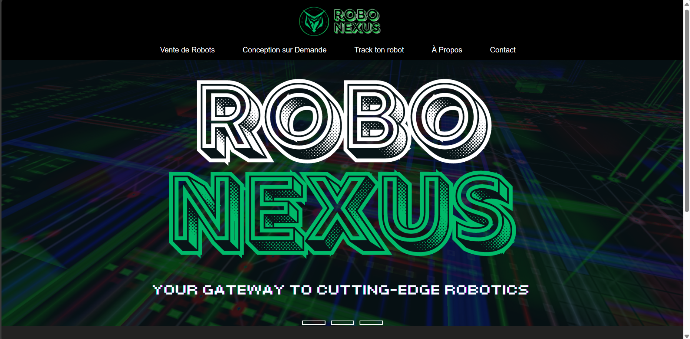

# RoboNexus - Conception de Robots | Données Temps Réel 

RoboNexus is a responsive website dedicated to the sale and custom design of robots. This project combines modern web technologies and design principles to create an engaging and functional online presence for RoboNexus.

## Team Members

MALKI Abdellah - ELKOUSSAMI Khalid - OUABDERH Mohamed - TAOUIL Abdellah

## Features

- **Responsive Navigation Bar:** The navigation bar transforms into a menu icon on smaller screens for a seamless browsing experience across all devices.
- **Image Slider:** A dynamic image slider showcases various robot models, changing images every 10 seconds or when clicked.
- **Service Sections:** Dedicated sections provide detailed information on robot sales and custom design services, ensuring customers can easily find the products and services they need.
- **Track Your Robot:** A crucial feature allowing users to authenticate with a robot/sensor ID and access real-time data about their robots.
- **Contact and About Sections:** Informative sections about RoboNexus and contact details for customer support and inquiries.
- **Login Page for Tracking:** A simple, secure login page where users can enter an identifier code to track their robots, with a background image to enhance the visual appeal.

## Track Your Robot

<p align="center">
  
</p>

### Presentation 
The "Track Your Robot" feature is an essential part of RoboNexus. It allows users to:
- **Authenticate with an Identifier Code:** Users can enter the unique identifier code provided with their sensor.
- **Access Real-Time Data:** Once authenticated, users can view real-time data about their sensors, such as temperature, speed, humidity, water flow, etc., depending on the sensor type.
- **User-Friendly Interface:** The tracking page features a simple and intuitive interface to ensure users can easily access the information they need.

          +---------------+                +-------------------+
          |               |                |                   |
          |   Browser     | <------------> |    Express.js     |
          | (Client Side) |                | (Server Side App) |
          |               |                |                   |
          +---------------+                +-------------------+
                   ^                                |
                   |                                |
                   v                                v
          +---------------+                +-------------------+
          |               |                |                   |
          |   Login Form  |                |  Sensor Data API  |
          | (track.html)  |                |  Endpoints        |
          |               |                |                   |
          +---------------+                +-------------------+
                   ^                                |
                   |                                |
                   v                                v
          +---------------+                +-------------------+
          |               |                |                   |
          | Sensor Data   | <------------> | MySQL Database    |
          | Display (EJS) |                |                   |
          | (sensor.ejs)  |                |                   |
          +---------------+                +-------------------+
                   ^
                   |
                   v
          +---------------+
          |               |
          | Sensor Data   |
          |     ESP32     |
          | or simulate.js|
          |               |
          +---------------+

### Install Dependencies 
<p align="center">
  
</p>

**1 Install Node.js and npm:**
	Download and install Node.js from nodejs.org. This will also install npm (Node Package Manager).

**2 Set up your project directory:**
	Create a new directory for your project and navigate into it.
	Initialize a new Node.js project by running npm init -y in the terminal. This will create a package.json file.

**3 Install required dependencies**
	- express: A web framework for Node.js.
	- mysql: A MySQL client for Node.js.
	- body-parser: Middleware to parse incoming request bodies.
	- axios: A promise-based HTTP client.
	- ejs: Embedded JavaScript templates.
	
	npm install express mysql body-parser axios ejs

**4 Set up your MySQL database:**
	Make sure you have MySQL installed and running on your machine.
	Create the sensors database and the necessary tables (loginrobot and any other tables you need).
	
	use sensors;
	create table if not exists loginrobot(
		robot_id int not null primary key auto_increment,
		robot_type varchar(255),
		robot_pass varchar(255)
	)

	!!!NB : don't forget to change the password in app.js
	
**5 start the applications**
	
 	node app.js
 
	cd esp32-simulator
	node simulate.js

### Sneak Peek at the login mecahanism

Sensors types and id code are stored in the loginrobot table in the Sensors database :


The login page : 


The script related to the database connection and checking wether the credentials exist in the loginrobot table or not, and if so redirecting to a page that will display the data according to the sensor's type : 

	 const connection = mysql.createConnection({
	  host: "localhost",
	  user: "root",
	  password: "my_password",
	  database: "sensors"
	});
	
	// Connect to the database
	connection.connect(function(error) {
	  if (error) throw error;
	  else console.log("Connected to the database successfully");
	});
	
	// Store data for each sensor by ID
	let sensorData = {};
	
	// Serve the login page
	app.get("/", function(req, res) {
	  res.sendFile(__dirname + "/track.html");
	});
	
	// Handle login and redirect based on sensor type
	app.post("/", encoder, function(req, res) {
	  var robottype = req.body.robottype;
	  var robotid = req.body.robotid;
	  connection.query("SELECT * FROM loginrobot WHERE robot_type = ? AND robot_pass = ?", [robottype, robotid], function(error, results, fields) {
	    if (results.length > 0) {
	      res.redirect(`/${robottype.toLowerCase()}?id=${robotid}`);
	    } else {
	      res.redirect("/");
	    }
	    res.end();
	  });
	});
 	.....


### The ESP32-Simulator 
The ESP32 simulator simulates the behavior of an ESP32 microcontroller, which is commonly used in IoT (Internet of Things) applications to gather sensor data. This simulator periodically generates and sends sensor data to your server to mimic the real-time operation of actual ESP32 devices in a production environment. Below is a detailed description of how this simulation works within your project.

<p align="center">
  
</p>

The primary purpose of the ESP32 simulator is to generate realistic sensor data and send it to the server's API endpoints. This allows to develop, test, and demonstrate the project without needing physical ESP32 devices and sensors.<br />

**Components and Workflow** <br />
The ESP32 simulator is implemented in a JavaScript file named simulate.js using Node.js and the axios library to send **HTTP requests**. The script performs the following functions:

- Data Generation: The simulator creates random values for different types of sensors (DHT, SPD, WTR) to simulate temperature, humidity, speed, and water level data.
- Data Sending: The generated data is packaged into HTTP POST requests and sent to the server's API endpoint at regular intervals.
- Error Handling: The simulator includes basic error handling to manage any issues that might occur during data transmission.

<p align="center">
  
</p>

**Implementation** <br />

    
    const axios = require('axios');
    const simulateSensorData = () => {
    const sensors = [{ id: '123456', type: 'DHT', data: { temperature: Math.random() * 30, humidity: Math.random() * 100 } },
    { id: '235874', type: 'DHT', data: { temperature: Math.random() * 30, humidity: Math.random() * 100 } },
    { id: '282828', type: 'SPD', data: { speed: Math.random() * 100 } },
    { id: '123456', type: 'SPD', data: { speed: Math.random() * 100 } },
    { id: '000000', type: 'WTR', data: { waterLevel: Math.random() * 100 } }];
    // Loop through each sensor to send its data
    sensors.forEach(sensor => {
    // Prepare the payload with sensor data
    const payload = {
      sensorId: sensor.id,
      type: sensor.type
    };
    if (sensor.type === 'DHT') {
      payload.temperature = sensor.data.temperature;
      payload.humidity = sensor.data.humidity;
    } else if (sensor.type === 'SPD') {
      payload.speed = sensor.data.speed;
    } else if (sensor.type === 'WTR') {
      payload.waterLevel = sensor.data.waterLevel;
    }

    // Send the data to the server
    axios.post('http://localhost:2800/api/data', payload)
      .then(response => {
        console.log(`Data sent for sensor ${sensor.id}:`, response.data);
      })
      .catch(error => {
        console.error(`Error sending data for sensor ${sensor.id}:`, error.message);
      });});};
      // Set an interval to send data every 5 seconds
      setInterval(simulateSensorData, 5000);
      

Data Generation: The sensors array contains objects representing different sensors, each with an ID, type, and randomly generated data. The types include:

- DHT for temperature and humidity sensors.
- SPD for speed sensors.
- WTR for water level sensors.

**Real ESP32 example**
Here is an example of how to upload data from an ESP32 microcontroller using a DHT11 sensor.

    
    const char* ssid = "Your_SSID";
    const char* password = "Your_PASSWORD";
    const char* serverUrl = "http://192.168.76.169:2800/api/data";
    #define DHTPIN 27    
    #define DHTTYPE DHT11 
    DHT dht(DHTPIN, DHTTYPE);
    float readDHTTemperature() {
    float t = dht.readTemperature();
    return isnan(t) ? 0 : t;
    }
    float readDHTHumidity() {
    float h = dht.readHumidity();
    return isnan(h) ? 0 : h;
    }
    void setup() {
    Serial.begin(9600);
    delay(100);
    WiFi.begin(ssid, password);
    Serial.println("Connecting to Wi-Fi");
    while (WiFi.status() != WL_CONNECTED) {
    delay(1000);
    Serial.println("Connecting to Wi-Fi...");}
    Serial.println("Connected to Wi-Fi ON");
    Serial.println(WiFi.localIP());
    }
    
    void loop() {
    if (WiFi.status() == WL_CONNECTED) {
    HTTPClient http;
    http.begin(serverUrl);
    http.addHeader("Content-Type", "application/json");
    float temperature = readDHTTemperature();   
    float humidity = readDHTHumidity();
    String jsonData = "{\"temperature\":" + String(temperature) + ",\"humidity\":" + String(humidity) + "}";
    int httpResponseCode = http.POST(jsonData);

    if (httpResponseCode > 0) {
      Serial.print("HTTP Response code: ");
      Serial.println(httpResponseCode);
      String response = http.getString();
      Serial.println("Response: ");
      Serial.println(response);
    } else {
      Serial.print("Error code: ");
      Serial.println(httpResponseCode);
    }

    http.end();
    }
    delay(5000);  // Send data every 5 seconds (adjust as needed) }
    .
    .
    .
    MMP"""""""MM MM"""""""`MM M""""""'YMM M""MMMMM""M M""M M"""""""`YM MMP"""""YMM              M""M M""""""'YMM MM""""""""`M 
    M' .mmmm  MM MM  mmmm,  M M  mmmm. `M M  MMMMM  M M  M M  mmmm.  M M' .mmm. `M              M  M M  mmmm. `M MM  mmmmmmmM 
    M         `M M'        .M M  MMMMM  M M  MMMMM  M M  M M  MMMMM  M M  MMMMM  M              M  M M  MMMMM  M M`      MMMM 
    M  MMMMM  MM MM  MMMb. "M M  MMMMM  M M  MMMMM  M M  M M  MMMMM  M M  MMMMM  M              M  M M  MMMMM  M MM  MMMMMMMM 
    M  MMMMM  MM MM  MMMMM  M M  MMMM' .M M  `MMM'  M M  M M  MMMMM  M M. `MMM' .M              M  M M  MMMM' .M MM  MMMMMMMM 
    M  MMMMM  MM MM  MMMMM  M M       .MM Mb       dM M  M M  MMMMM  M MMb     dMM              M  M M       .MM MM        .M 
    MMMMMMMMMMMM MMMMMMMMMMMM MMMMMMMMMMM MMMMMMMMMMM MMMM MMMMMMMMMMM MMMMMMMMMMM oooooooooooo MMMM MMMMMMMMMMM MMMMMMMMMMMM 
	
<p align="center">
  
</p>

### demo (when app works)


## Technologies Used

- HTML5
- CSS3
- JavaScript
- MySQL
- jQuery
- Node js

## Installation

1. Clone the repository:
    ```bash
    git clone https://github.com/your-username/RoboNexus.git
    ```
2. Navigate to the project directory:
    ```bash
    cd RoboNexus
    ```
3. Open `index.html` in your preferred web browser.

## Usage

- **Navigation:** Use the navigation bar to browse different sections of the website.
- **Slider:** The image slider will automatically change images every 10 seconds. Click on the slider to manually change the image.
- **Track Your Robot:** Click on the "Track ton robot" button to go to the tracking page, where you can enter your robot's identifier code to get real-time information.
- **Login Page:** The login page is accessible via the "Track ton robot" button and features a background image for enhanced visual appeal.

## Screenshots

### Home Page


### Track Your Robot


---
