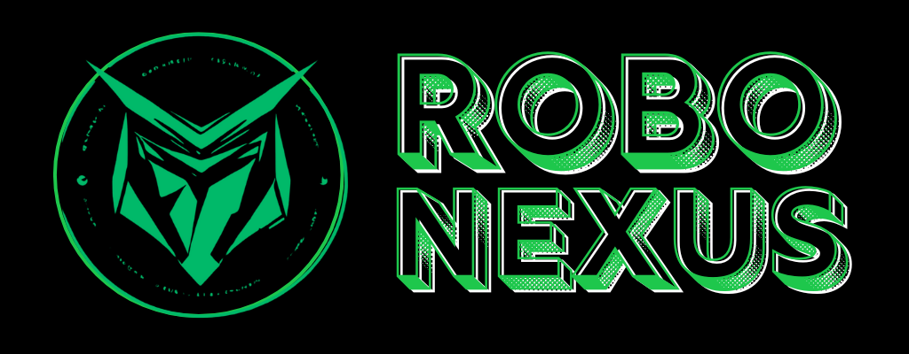

# RoboNexus - Conception de Robots | Données Temps Réel 

RoboNexus is a website dedicated to the sale and custom design of robots, and also the display of real time data of the sold robots. This project combines modern web technologies and design principles to create an engaging and functional online presence for RoboNexus.

## Team Members

MALKI Abdellah - ELKOUSSAMI Khalid - OUABDERH Mohamed - TAOUIL Abdellah

## Features

- **Home Page**: Overview and navigation.
- **Shop Page**: Browse and purchase different types of robots.
- **Custom Design Page**: Customize your own robots by selecting components and submitting custom orders.
- **Track Your Robot Page**: Real-time data display from various sensors on the robots.
- **Contact Page**: Communication with the support team.
- **Backend (app.js)**: Server-side logic for handling form submissions, data processing, and database communication.
- **ESP32 Simulator**: Simulates sensor data for demonstration purposes.

## Project Structure

- **public/**: Contains static files (CSS, JavaScript, images).
- **views/**: Contains HTML templates.
- **app.js**: Main server-side application logic.
- **routes/**: Defines routes for handling HTTP requests.

## High-Level Architecture Diagram

Below is a high-level architecture diagram illustrating the different components of the RoboNexus platform and the flow of data from different robots.

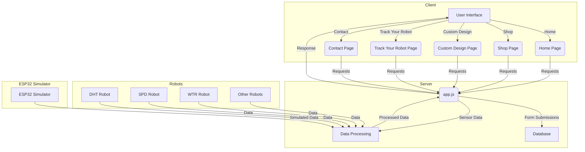
### Explanation : 

- Client: Represents the front-end user interface with different pages.
- Server: Handles requests from the client, processes data, and communicates with the database.
- Robots: Different types of robots sending sensor data to the server.
- ESP32 Simulator: Simulates sensor data for demonstration purposes.
- Data Flow: Shows how data flows from robots to the server for processing and then back to the client.


## Architecture Overview
The RoboNexus project follows a clear separation of concerns between the front-end and back-end components.

**Front-End**
- Languages: HTML, CSS, JavaScript
- Frameworks: None (Vanilla HTML/CSS/JS)
- Directory: public/ <br />
The front-end is responsible for rendering the user interface, capturing user interactions, and displaying data. It includes static HTML pages styled with CSS and enhanced with JavaScript for interactivity.

**Back-End**
- Languages: JavaScript (Node.js)
- Frameworks: Express.js
- Directory: Root directory (e.g., app.js) <br />
The back-end handles server-side logic, including routing, data processing, and interaction with the database. It is built using Node.js with the Express.js framework.

**ESP32 Simulator**
- Languages: JavaScript (Node.js)
- Directory: esp32-simulator/ <br />
The ESP32 simulator mimics sensor data sent from robots, which is used for demonstration and testing purposes.

## API Endpoints

- GET /: Serves the login page.
- POST /: Handles login and redirects based on sensor type.
- GET /dht: Serves the DHT sensor page with dynamic data.
- GET /spd: Serves the SPD sensor page with dynamic data.
- GET /wtr: Serves the WTR sensor page with dynamic data.
- POST /api/data: Receives data from sensors.
- GET /api/data/ : Retrieves data for a specific sensor.
- POST /subscribe: Handles newsletter subscription.
- POST /send-email: Handles contact form submission.
- POST /submit-custom-order: Handles custom order form submission.

## Track Your Robot

<p align="center">
  
</p>

### Presentation 
The "Track Your Robot" feature is an essential part of RoboNexus. It allows users to:
- **Authenticate with an Identifier Code:** Users can enter the unique identifier code provided with their sensor.
- **Access Real-Time Data:** Once authenticated, users can view real-time data about their sensors, such as temperature, speed, humidity, water flow, etc., depending on the sensor type.
- **User-Friendly Interface:** The tracking page features a simple and intuitive interface to ensure users can easily access the information they need.

          +---------------+                +-------------------+
          |               |                |                   |
          |   Browser     | <------------> |    Express.js     |
          | (Client Side) |                | (Server Side App) |
          |               |                |                   |
          +---------------+                +-------------------+
                   ^                                |
                   |                                |
                   v                                v
          +---------------+                +-------------------+
          |               |                |                   |
          |   Login Form  |                |  Sensor Data API  |
          | (track.html)  |                |  Endpoints        |
          |               |                |                   |
          +---------------+                +-------------------+
                   ^                                |
                   |                                |
                   v                                v
          +---------------+                +-------------------+
          |               |                |                   |
          | Sensor Data   | <------------> | MySQL Database    |
          | Display (EJS) |                |                   |
          | (sensor.ejs)  |                |                   |
          +---------------+                +-------------------+
                   ^
                   |
                   v
          +---------------+
          |               |
          | Sensor Data   |
          |     ESP32     |
          | or simulate.js|
          |               |
          +---------------+

### Install Dependencies 
<p align="center">
  
</p>

**1 Install Node.js and npm:**
	Download and install Node.js from nodejs.org. This will also install npm (Node Package Manager).

**2 Set up your project directory:**
	Create a new directory for your project and navigate into it.
	Initialize a new Node.js project by running npm init -y in the terminal. This will create a package.json file.

**3 Install required dependencies**
	- express: A web framework for Node.js.
	- mysql: A MySQL client for Node.js.
	- body-parser: Middleware to parse incoming request bodies.
	- axios: A promise-based HTTP client.
	- ejs: Embedded JavaScript templates.
	
	npm install express mysql body-parser axios ejs

**4 Set up your MySQL database:**
	Make sure you have MySQL installed and running on your machine.
	Create the sensors database and the necessary tables (loginrobot and any other tables you need).
	
	use sensors;
	create table if not exists loginrobot(
		robot_id int not null primary key auto_increment,
		robot_type varchar(255),
		robot_pass varchar(255)
	)

	!!!NB : don't forget to change the password in app.js
	
**5 start the applications**
	
 	node app.js
 
	cd esp32-simulator
	node simulate.js

### Sneak Peek at the login mecahanism

Sensors types and id code are stored in the loginrobot table in the Sensors database :
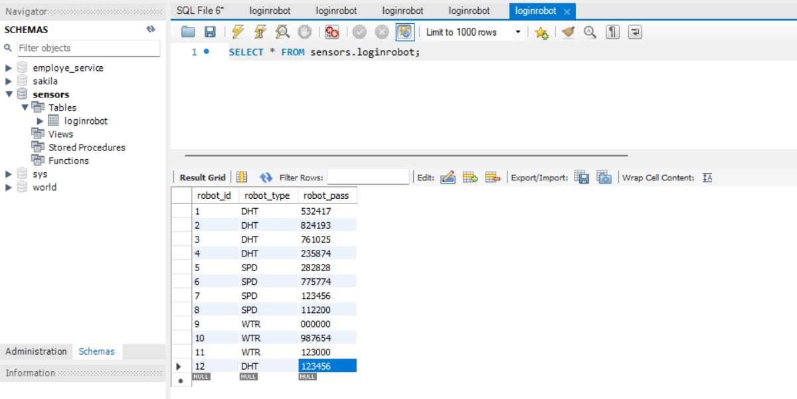

The login page : 

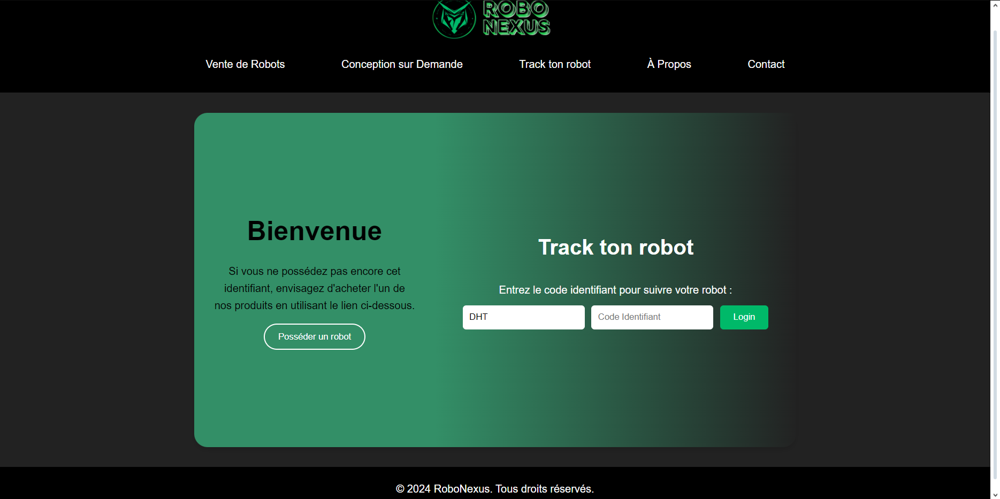

The script related to the database connection and checking wether the credentials exist in the loginrobot table or not, and if so redirecting to a page that will display the data according to the sensor's type : 

	 const connection = mysql.createConnection({
	  host: "localhost",
	  user: "root",
	  password: "my_password",
	  database: "sensors"
	});
	
	// Connect to the database
	connection.connect(function(error) {
	  if (error) throw error;
	  else console.log("Connected to the database successfully");
	});
	
	// Store data for each sensor by ID
	let sensorData = {};
	
	// Serve the login page
	app.get("/", function(req, res) {
	  res.sendFile(__dirname + "/track.html");
	});
	
	// Handle login and redirect based on sensor type
	app.post("/", encoder, function(req, res) {
	  var robottype = req.body.robottype;
	  var robotid = req.body.robotid;
	  connection.query("SELECT * FROM loginrobot WHERE robot_type = ? AND robot_pass = ?", [robottype, robotid], function(error, results, fields) {
	    if (results.length > 0) {
	      res.redirect(`/${robottype.toLowerCase()}?id=${robotid}`);
	    } else {
	      res.redirect("/");
	    }
	    res.end();
	  });
	});
 	.....


### The ESP32-Simulator 
The ESP32 simulator simulates the behavior of an ESP32 microcontroller, which is commonly used in IoT (Internet of Things) applications to gather sensor data. This simulator periodically generates and sends sensor data to your server to mimic the real-time operation of actual ESP32 devices in a production environment. Below is a detailed description of how this simulation works within your project.

<p align="center">
  
</p>

The primary purpose of the ESP32 simulator is to generate realistic sensor data and send it to the server's API endpoints. This allows to develop, test, and demonstrate the project without needing physical ESP32 devices and sensors.<br />

**Components and Workflow** <br />
The ESP32 simulator is implemented in a JavaScript file named simulate.js using Node.js and the axios library to send **HTTP requests**. The script performs the following functions:

- Data Generation: The simulator creates random values for different types of sensors (DHT, SPD, WTR) to simulate temperature, humidity, speed, and water level data.
- Data Sending: The generated data is packaged into HTTP POST requests and sent to the server's API endpoint at regular intervals.
- Error Handling: The simulator includes basic error handling to manage any issues that might occur during data transmission.

<p align="center">
  
</p>

**Implementation** <br />

    
    const axios = require('axios');
    const simulateSensorData = () => {
    const sensors = [{ id: '123456', type: 'DHT', data: { temperature: Math.random() * 30, humidity: Math.random() * 100 } },
    { id: '235874', type: 'DHT', data: { temperature: Math.random() * 30, humidity: Math.random() * 100 } },
    { id: '282828', type: 'SPD', data: { speed: Math.random() * 100 } },
    { id: '123456', type: 'SPD', data: { speed: Math.random() * 100 } },
    { id: '000000', type: 'WTR', data: { waterLevel: Math.random() * 100 } }];
    // Loop through each sensor to send its data
    sensors.forEach(sensor => {
    // Prepare the payload with sensor data
    const payload = {
      sensorId: sensor.id,
      type: sensor.type
    };
    if (sensor.type === 'DHT') {
      payload.temperature = sensor.data.temperature;
      payload.humidity = sensor.data.humidity;
    } else if (sensor.type === 'SPD') {
      payload.speed = sensor.data.speed;
    } else if (sensor.type === 'WTR') {
      payload.waterLevel = sensor.data.waterLevel;
    }

    // Send the data to the server
    axios.post('http://localhost:2800/api/data', payload)
      .then(response => {
        console.log(`Data sent for sensor ${sensor.id}:`, response.data);
      })
      .catch(error => {
        console.error(`Error sending data for sensor ${sensor.id}:`, error.message);
      });});};
      // Set an interval to send data every 5 seconds
      setInterval(simulateSensorData, 5000);
      

Data Generation: The sensors array contains objects representing different sensors, each with an ID, type, and randomly generated data. The types include:

- DHT for temperature and humidity sensors.
- SPD for speed sensors.
- WTR for water level sensors.

**Real ESP32 example**
Here is an example of how to upload data from an ESP32 microcontroller using a DHT11 sensor.

    
    const char* ssid = "Your_SSID";
    const char* password = "Your_PASSWORD";
    const char* serverUrl = "http://192.168.76.169:2800/api/data";
    #define DHTPIN 27    
    #define DHTTYPE DHT11 
    DHT dht(DHTPIN, DHTTYPE);
    float readDHTTemperature() {
    float t = dht.readTemperature();
    return isnan(t) ? 0 : t;
    }
    float readDHTHumidity() {
    float h = dht.readHumidity();
    return isnan(h) ? 0 : h;
    }
    void setup() {
    Serial.begin(9600);
    delay(100);
    WiFi.begin(ssid, password);
    Serial.println("Connecting to Wi-Fi");
    while (WiFi.status() != WL_CONNECTED) {
    delay(1000);
    Serial.println("Connecting to Wi-Fi...");}
    Serial.println("Connected to Wi-Fi ON");
    Serial.println(WiFi.localIP());
    }
    
    void loop() {
    if (WiFi.status() == WL_CONNECTED) {
    HTTPClient http;
    http.begin(serverUrl);
    http.addHeader("Content-Type", "application/json");
    float temperature = readDHTTemperature();   
    float humidity = readDHTHumidity();
    String jsonData = "{\"temperature\":" + String(temperature) + ",\"humidity\":" + String(humidity) + "}";
    int httpResponseCode = http.POST(jsonData);

    if (httpResponseCode > 0) {
      Serial.print("HTTP Response code: ");
      Serial.println(httpResponseCode);
      String response = http.getString();
      Serial.println("Response: ");
      Serial.println(response);
    } else {
      Serial.print("Error code: ");
      Serial.println(httpResponseCode);
    }

    http.end();
    }
    delay(5000);  // Send data every 5 seconds (adjust as needed) }
    .
    .
    .
    MMP"""""""MM MM"""""""`MM M""""""'YMM M""MMMMM""M M""M M"""""""`YM MMP"""""YMM              M""M M""""""'YMM MM""""""""`M 
    M' .mmmm  MM MM  mmmm,  M M  mmmm. `M M  MMMMM  M M  M M  mmmm.  M M' .mmm. `M              M  M M  mmmm. `M MM  mmmmmmmM 
    M         `M M'        .M M  MMMMM  M M  MMMMM  M M  M M  MMMMM  M M  MMMMM  M              M  M M  MMMMM  M M`      MMMM 
    M  MMMMM  MM MM  MMMb. "M M  MMMMM  M M  MMMMM  M M  M M  MMMMM  M M  MMMMM  M              M  M M  MMMMM  M MM  MMMMMMMM 
    M  MMMMM  MM MM  MMMMM  M M  MMMM' .M M  `MMM'  M M  M M  MMMMM  M M. `MMM' .M              M  M M  MMMM' .M MM  MMMMMMMM 
    M  MMMMM  MM MM  MMMMM  M M       .MM Mb       dM M  M M  MMMMM  M MMb     dMM              M  M M       .MM MM        .M 
    MMMMMMMMMMMM MMMMMMMMMMMM MMMMMMMMMMM MMMMMMMMMMM MMMM MMMMMMMMMMM MMMMMMMMMMM oooooooooooo MMMM MMMMMMMMMMM MMMMMMMMMMMM 
	
<p align="center">
  
</p>

### Real time data display AT WORK
We run the esp32-simulator/simulate.js 
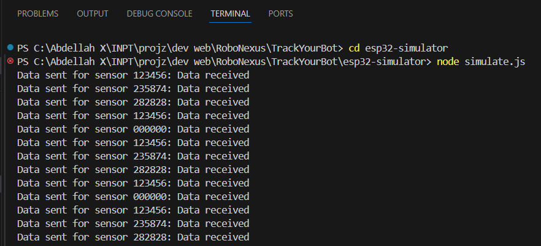<br />
The simulated data from six sensors is sent through http post request to 'http://localhost:2800/api/data' and well received by our server. <br />


When checking the cosole of app.js we can see the value and type of data sent by each sensor :<br />
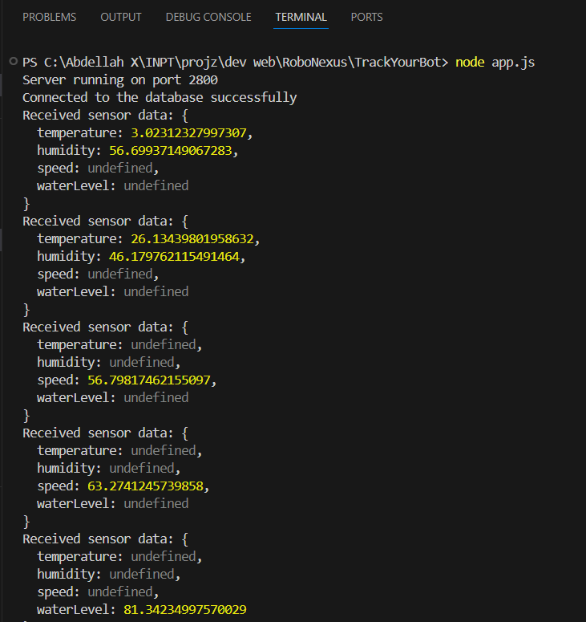

Finally with the sensor.ejs file we can display the data in a web page : 
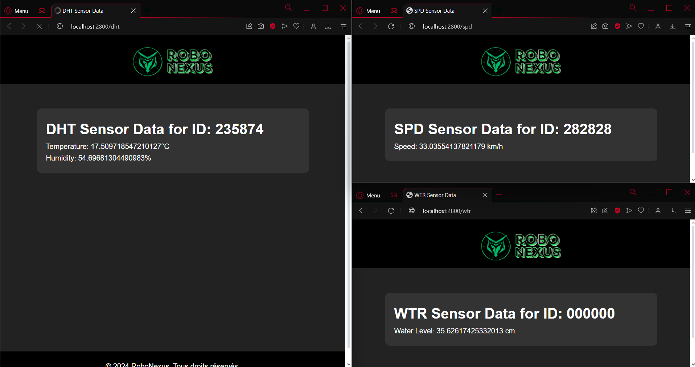

## Shop & Custom Design  
### Shop 
Allows users to browse and purchase different types of robots. <br />
When choosing  to buy one of our 3 robots (DHT, SPD, WTR), the client will be redirected to the information section where they'll fill in their name, phone number, email and address. <br />
The order is then insered in the orders table in our database.

And an email is sent to us with details of the  order :
<p align="center">
  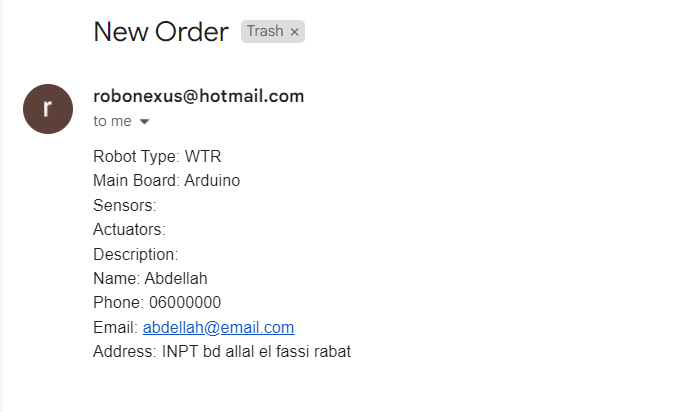
</p>
using this bit of script : 

```bash
const transporter = nodemailer.createTransport({
service: 'hotmail',
  auth: {
    user: process.env.EMAIL_USER,
    pass: process.env.EMAIL_PASS
  }
});

// Handling custom order form submission
app.post('/submit-custom-order', (req, res) => {
  const { robotType, mainBoard, sensors, actuators, description, name, phone, email, address } = req.body;

  const mailOptions = {
    from: process.env.EMAIL_USER,
    to: 'robonexus2024@gmail.com',
    subject: 'New Order',
    text: `Robot Type: ${robotType}\nMain Board: ${mainBoard}\nSensors: ${sensors.join(', ')}\nActuators: ${actuators.join(', ')}\nDescription: ${description}\nName: ${name}\nPhone: ${phone}\nEmail: ${email}\nAddress: ${address}`
  };

  transporter.sendMail(mailOptions, (error, info) => {
    if (error) {
      console.log(error);
      res.status(500).send('Error sending email');
    } else {
      console.log('Email sent: ' + info.response);
      res.status(200).send('Order submitted successfully');
    }
  });
});
```
	
This part requires to install few more dependencies 

	npm install nodemailer dotenv

#### Security 
For security reasons, it's recommended to store email credentials in environment variables instead of hardcoding them in your application. We can use the dotenv package for this by creating .env file in the root of the project and adding the credentials. <br />
And also all input fields must be checked and match the type in order to prevent any ***SQL Injection**.
<p align="center">
  
</p>

### Custom designed Robots
Enables users to customize their own robots, including selecting components and submitting custom orders. <br />
Users can choose on of the existing robots or click on other, when they do so they can fully customize their robot by choosing the main board, sensors, actuators and add a description of what they want. All these informations are sent to us by email and added to the Orders table in our database along with the regular orders from the shop.
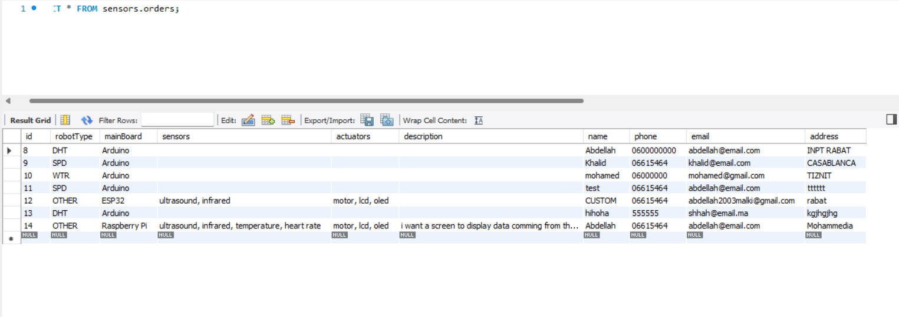


## Contact page
Facilitates communication between users and the platform's support team.<br />
Using the same principle of the shop page to send us emails from users (Nodemailer js) :
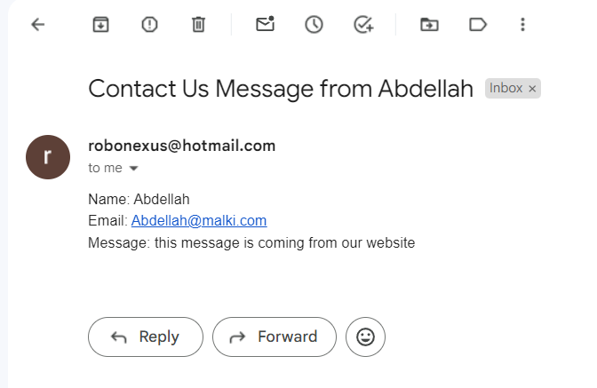


## Setup 

## Screenshots

### Home Page
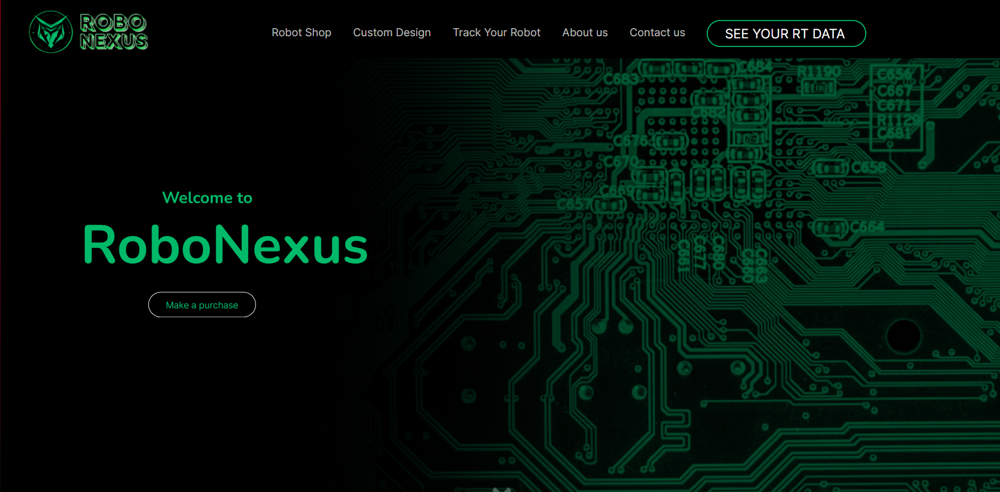
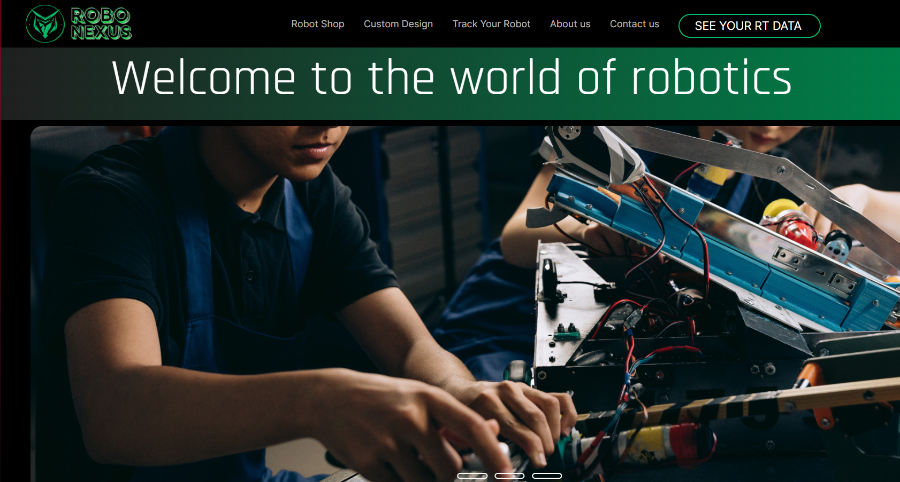
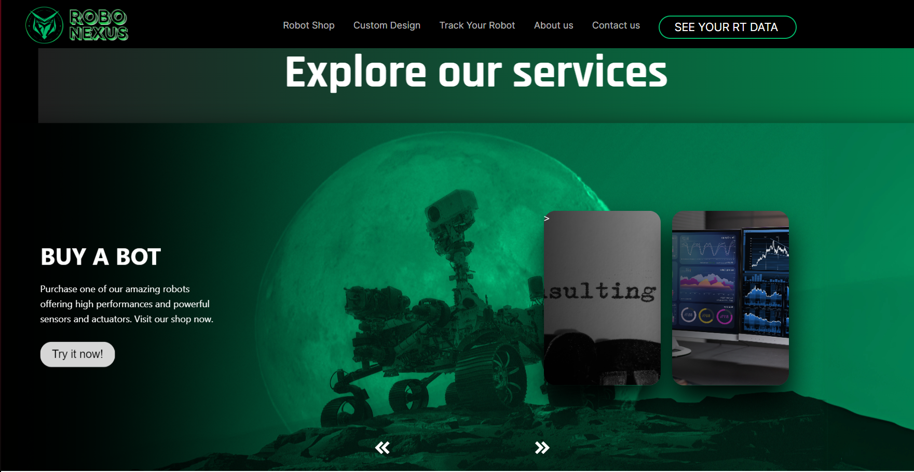
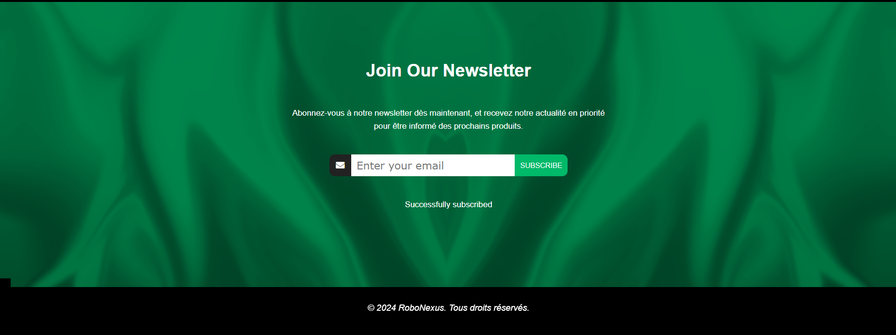

### Track Your Robot


### Shop 
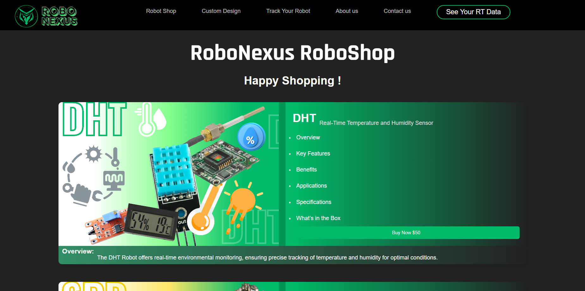
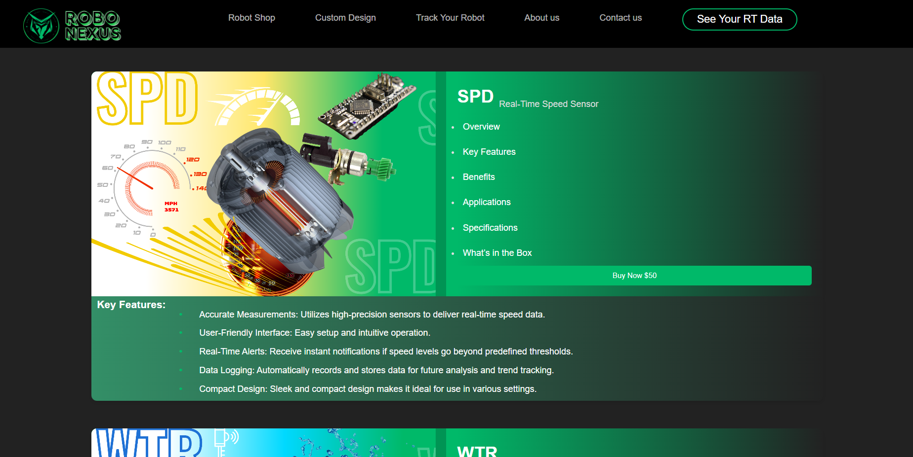
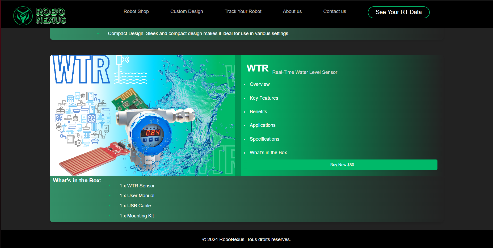

### Custom Design 
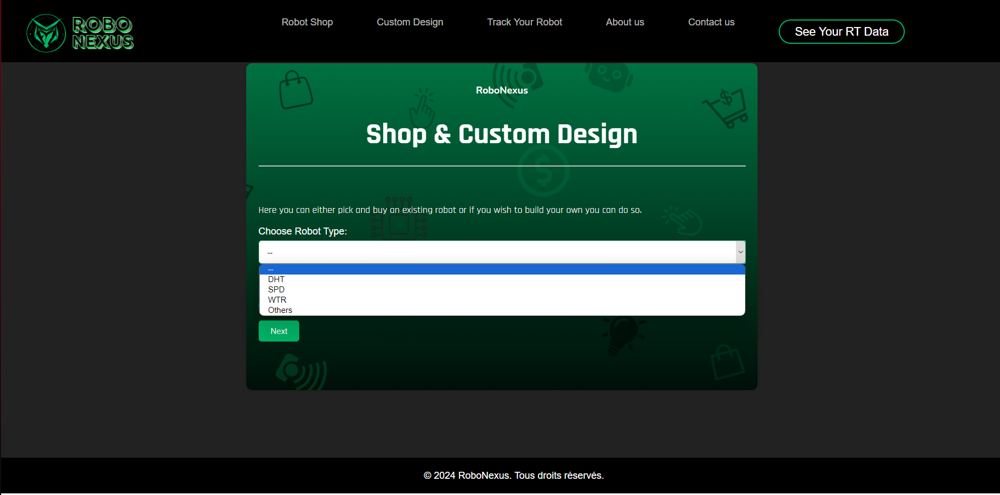

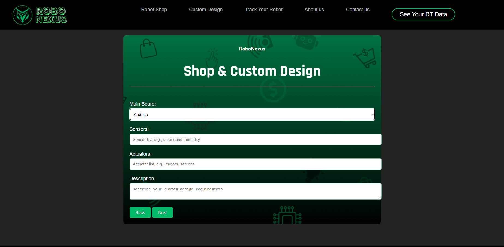
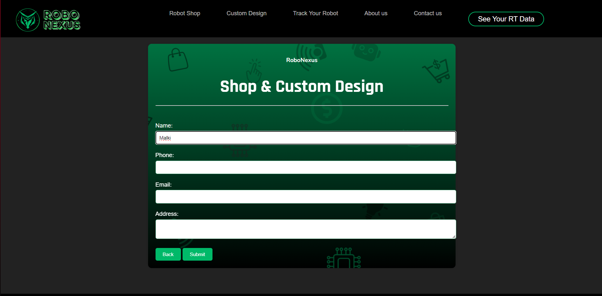
### Contact us
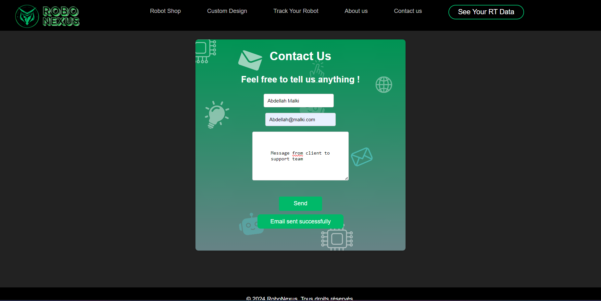

## Video Demo
Here's the link to the demo video : 
https://drive.google.com/file/d/1Sfjq5avNn_VE0GPJ4e0ot63SIOG6-txq/view?usp=sharing
---
